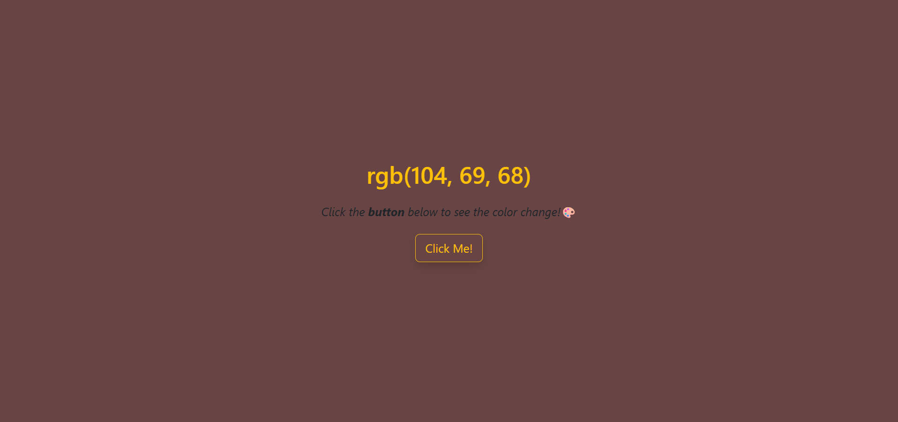

# 🌈 ColorSplash

**ColorSplash** is a simple, interactive web application that changes the background color of the page to a randomly generated RGB value each time the button is clicked. The new color is also displayed as *text* on the page.

---

## Screenshot

### ColorSplash Preview
This preview shows the page after clicking the button — background color and RGB value update dynamically.


---

## Features

- Changes the background color of the page to a random color on button click.
- Displays the selected RGB color code on the screen
- Styled using **Bootstrap** for a clean and responsive design.

---

## Technologies Used

- **HTML5**
- **Bootstrap 5.3.6**
- **JavaScript (ES6+)**

---

## Getting Started

1. Clone the repository:
    ```bash
    git clone https://github.com/Misba0019/ColorSplash.git
    ```

---

## How to use

1. Open `project_color.html` in your web browser.
2. Click the "Click Me!" button.
3. Watch the background color change and view the new RGB value displayed in the center of the page.

---

## Contributing

Contributions are welcome! Feel free to fork the repository and submit a pull request.  

---

## License

This project is licensed under the MIT License. See the [LICENSE](LICENSE) file for details.